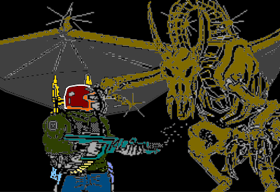

# Estación Acuario

_Estación Acuario es un relato interactivo escrito mediante Inform 6._

> Con la nave averiada, aterrizas en la **Estación Acuario** para poder repararla y continuar con tu viaje.

## Construcción

Este relato interactivo ha sido escrito en [Inform 6](https://github.com/DavidKinder/Inform6). Será necesario utilizar `bresc` y las herramientas `blorb`. El proyecto [Scinf](http://github.com/baltasarq/Scinf) será de gran ayuda.

## Ejecución

Una vez construido el archivo `.blb`, o `.z8`, o descargados de la sección `releases`, deben ser ejecutados mediante un intérprete como [Gargoyle](https://ccxvii.net/gargoyle/).
